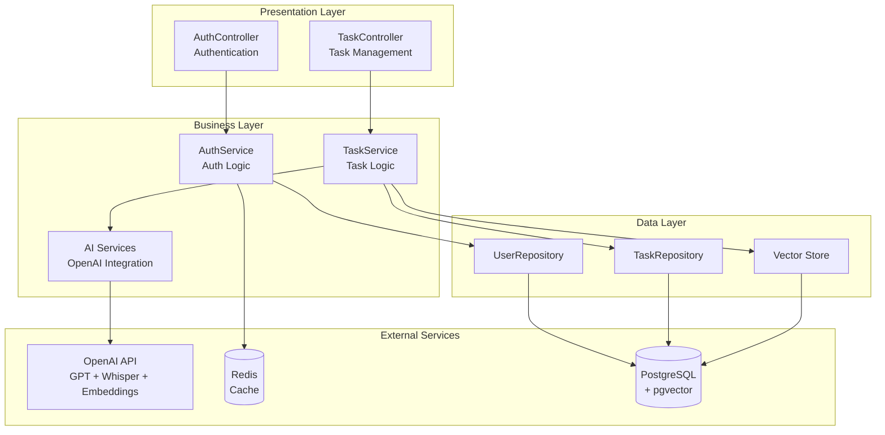
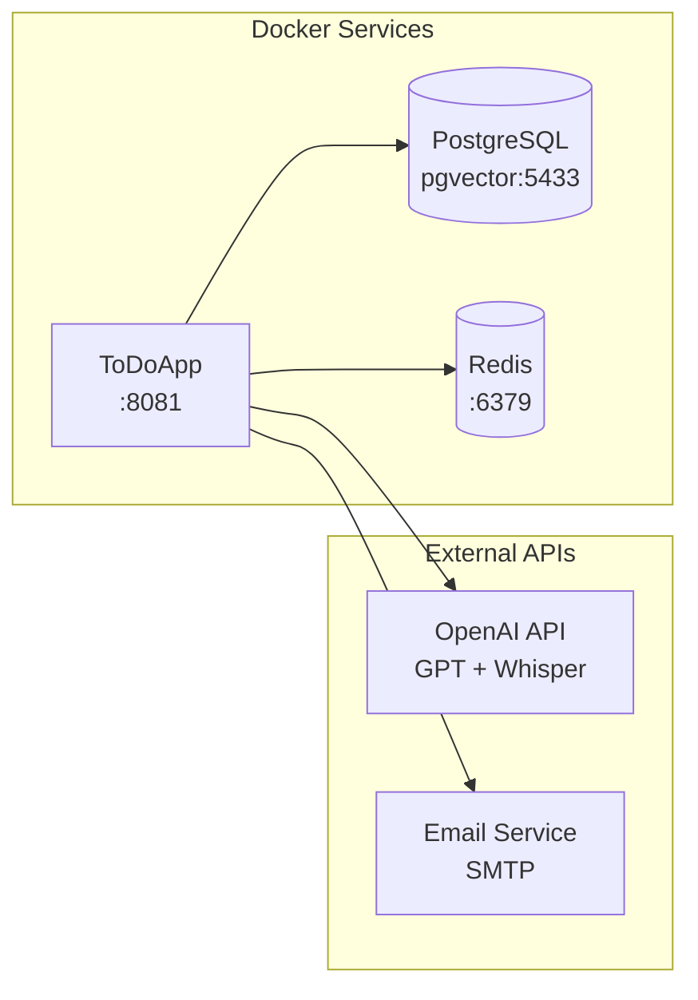
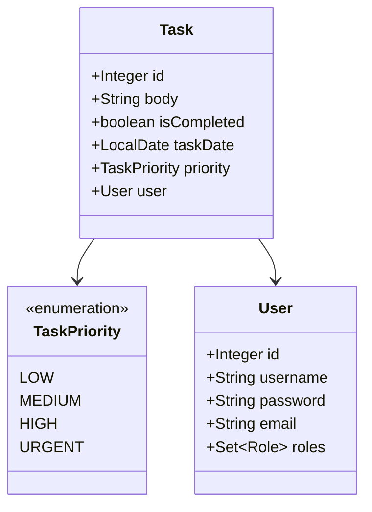
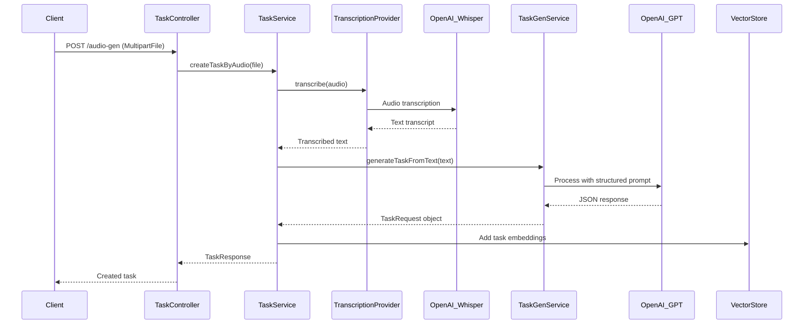

## 📋 Project Description

ToDoApp is a task management application built with Spring Boot that integrates advanced artificial intelligence features. [1](#2-0)  The application allows users to create, manage, and search tasks in traditional ways, while also incorporating AI capabilities such as task generation from audio input and semantic similarity search. [2](#2-1) 

## 🚀 Technologies Used

### Backend Framework
- **Spring Boot 3.5.3** - Main application framework
- **Java 21** - Java version used
- **Spring Security** - Authentication and authorization system
- **Spring Data JPA** - Data persistence

### Database and Storage
- **PostgreSQL** - Main database with pgvector extension [3](#2-2) 
- **Redis** - Cache and token management [4](#2-3) 
- **pgvector** - Vector storage for semantic search [5](#2-4) 

### Artificial Intelligence
- **Spring AI 1.0.0** - AI integration framework
- **OpenAI GPT-3.5-turbo** - Chat model for text processing [6](#2-5) 
- **OpenAI Whisper** - Audio to text transcription [7](#2-6) 
- **text-embedding-3-small** - Embedding model for vectorial search [8](#2-7) 

### Security and Validation
- **JWT (JSON Web Tokens)** - Token-based authentication
- **Spring Validation** - Input data validation
- **Lombok** - Boilerplate code reduction

## 🏗️ System Architecture



## ✨ Key Features

### Traditional Task Management
- **Complete CRUD** - Create, read, update and delete tasks [9](#2-8) 
- **Advanced filtering** - By date, priority and completion status [10](#2-9) 
- **Sorting** - By ascending and descending priority [11](#2-10) 
- **Combined queries** - Multiple simultaneous filters

### AI Features

#### Audio Task Generation
- **Automatic transcription** - Converts audio to text using OpenAI Whisper [12](#2-11) 
- **Intelligent processing** - Extracts structured information with GPT-3.5 [13](#2-12) 
- **Automatic validation** - Generates validated TaskRequest objects [14](#2-13) 

#### Semantic Search
- **Similarity search** - Finds semantically related tasks [15](#2-14) 
- **Vector embeddings** - Uses text-embedding-3-small for vectorization
- **pgvector storage** - Optimized vector database

### Authentication System
- **Registration and login** - Complete user management system
- **JWT tokens** - Secure token-based authentication
- **Password recovery** - Email-based reset system
- **Secure logout** - Token invalidation

## 🐳 Installation and Configuration

### Prerequisites
- Docker and Docker Compose
- `.env` file configured (based on `.env_template`) [16](#2-15) 

### Required Environment Variables
- `DB_USERNAME` - PostgreSQL user
- `DB_PASSWORD` - PostgreSQL password
- `API_KEY` - OpenAI API key
- `EMAIL_HOST` - SMTP server for emails
- `EMAIL_PASSWORD` - Email password
- `REDIS_HOST` - Redis host (default: redis)
- `REDIS_PORT` - Redis port (default: 6379)

### Installation Steps

1. **Initial configuration:**
   ```bash
   # Copy and configure environment variables
   cp .env_template .env
   # Edit .env with your credentials
   ```

2. **To generate new JAR:**
   ```bash
   docker-compose up -d pgvector
   # Generate JAR
   docker-compose down -v
   ``` [17](#2-16) 

3. **Run complete application:**
   ```bash
   docker-compose up --build -d
   ``` [18](#2-17) 

### Service Configuration



## 📚 API Endpoints

### Authentication (`/auth`)
- `POST /auth/login` - Login
- `POST /auth/register` - Register user
- `POST /auth/logout` - Logout
- `POST /auth/forgot-password` - Password recovery
- `GET /auth/validate-reset-token` - Validate reset token
- `POST /auth/change-password` - Change password

### Task Management (`/api/tasks`)

#### GET Endpoints
- `GET /api/tasks` - Get all tasks [19](#2-18) 
- `GET /api/tasks/search?body={text}` - Search by content [20](#2-19) 
- `GET /api/tasks/by-date?date=yyyy/MM/dd` - Filter by date [21](#2-20) 
- `GET /api/tasks/by-priority?priority={PRIORITY}` - Filter by priority [22](#2-21) 
- `GET /api/tasks/completed?completed={boolean}` - Filter by status [23](#2-22) 
- `GET /api/tasks/order-by-priority-asc` - Sort by ascending priority [24](#2-23) 
- `GET /api/tasks/order-by-priority-desc` - Sort by descending priority [25](#2-24) 
- `GET /api/tasks/search-by-similarities?body={text}` - Semantic search [26](#2-25) 

#### Modification Endpoints
- `POST /api/tasks` - Create new task [27](#2-26) 
- `PUT /api/tasks/{id}` - Update existing task [28](#2-27) 
- `DELETE /api/tasks/{id}` - Delete task [29](#2-28) 
- `POST /api/tasks/audio-gen` - Create task from audio [30](#2-29) 

#### Utilities
- `GET /api/tasks/vector-seed` - Initialize vector database [31](#2-30) 

## 📊 Data Model

### Task Entity


## 🧠 AI Integration

### Audio Task Generation Flow



### AI Configuration
- **Chat Model:** GPT-3.5-turbo for text processing [6](#2-5) 
- **Embedding Model:** text-embedding-3-small for vectorization [8](#2-7) 
- **Vector Store:** pgvector with 1536 dimensions and cosine distance [5](#2-4) 
- **HNSW Configuration:** Optimized index for neighbor search

## 🔧 Project Structure

```
src/main/java/com/juangomez/todoapp/
├── ai/                          # AI Services
│   ├── provider/               # Transcription providers
│   ├── service/               # AI service interfaces
│   └── serviceimpl/           # AI implementations
├── config/                     # Configurations
│   └── authentication/        # Security config
├── controller/                # REST Controllers
├── dto/                       # Data Transfer Objects
├── model/                     # JPA Entities
│   └── enums/                # Enumerations
├── repository/               # Data repositories
├── service/                  # Service interfaces
└── serviceimpl/             # Service implementations
```

## 🔒 Security

### JWT System
- **Token generation** secure for authentication
- **Automatic validation** on each request to protected endpoints
- **Token blacklist** for secure logout
- **Password renewal** with temporary tokens

### Data Isolation
- **User filtering** in all operations [32](#2-31) 
- **Permission validation** in service layer
- **Security context** for user identification
